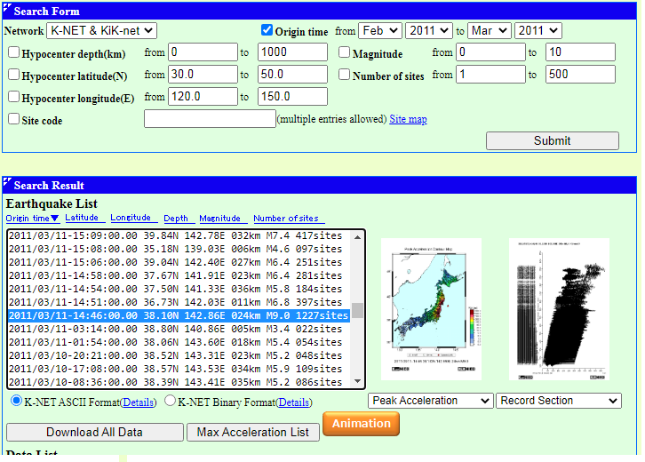
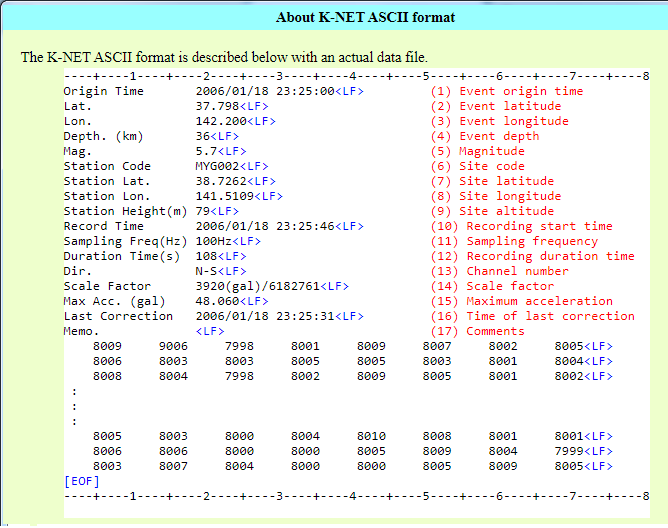
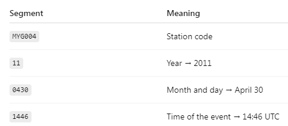

## Japan Data Hi-Net

Content: most of the documentation is tentative. It's not built yet but it will be soon.
I should mention that data source is K-NET (Kyoshin Network) in specific.

## Index

1.  [Plan](#Plan)
3.  [Extracting Data](#Extracting-data)
4.  [Script cleaner process: from raw data](#Script-cleaner-process:-from-raw-data)
5.  [Proceeding](#Proceeding)
6.  [CMD tool](#CMD-tool)

    5.1 [Asking](#Asking)
    
    5.2 [Checking](#Checking)
    
    5.3 [Display](#Display)

     5.3.1 [Waves](#Waves)
    
     5.3.2 [Bitmap](#Bitmap)
    
        
8.  [Building](#Building)       

### Plan
The following stages are established in order to perform a proper data analysis;

* Data collection
* Storage
* Cleanup
* Transformation
* Analytics
* Insights

Data collection, storage, cleanup, and transformation range from the direct handling of data to its shaping, being finally processed and analized. The final part is focused on understanding and giving a meaning to the raw data.

The main analytical method is Principal Component Analysis (PCA). This approach makes it possible to identify patterns within the large amount of information provided.

### Extracting data
First, data is available in the NIED site's database. Specificaly, the K-NET (Kyoshin Network) will be our great provider on this journey. Look at: https://www.bosai.go.jp/e/research/database/earthquake.html

Then, I choose the K-NET tool. Once an earthquake is selected, I have two options
* "Download All Channels Data"
* "Download All Data" (ASCII or binary)
The second option in ASCII is the choosen one.

### Script cleaner process: from raw data
Files will be in ASCII or binary format, then I must check and process them in such a way to get them ready for storage in the database.

First, we select an earthquake. In our case, the well known March-11-2011 Tohoku eartquake. 



The browser will download a tar file which contains our data. The following is just decomprise it.
NIED gives us, a bunch of data, placed in different files. Per station there will a file for each components; UD (up-down), the NS(north-south) and EW(east-west). It's possible to identify what we have by the name of the file.(capture2.png)



In our example, you can see (capture1.png) that there are 1.227 sites, 1.227 stations and each one contains UD, NS and EW wave components as time series, along with other information.
Using an .UD file, we can see (capture3.png) how the ASCII file looks like, the called K-NET ASCII file. It starts with 17 lines of metadata and from the 18 line a time-series begins which represents the wave in its UD component.



### Proceeding
There will be a table that contains the studied earthquakes and its most important metadata.

* Geiyo Islands -> March-24 (2001)
* Chuetsu -> October-23 (2004)
* Chuetsu -> July-16 (2007)
* Iwate-Miyagi -> June-14 (2008)
* Miyagi -> April-7 (2011)
* Tokyo -> March-11 (2011)
* Fukushima -> April-17 (2013)
* Fukushima -> April-19 (2013)
* Hokkaido -> September-6 (2018)
* Fukushima -> Febraury-13 (2021)
* Noto -> January-1 (2024)

At the beginning, are considered; depth, magnitude, prefecture, year, etc. This will allow an accurate control over data, paying attention to its integrity.

The best is to include more and more earthquakes. This process will be done using a c++ software for examining each file through a command line tool. This allows scalability, and possibly continuos integration in a future server-type project.

From each time-series (UD at first) we can get:
* Mean and peak values
* Some type of pattern durgin the shaking like, decaing, attenuance, code, aparent velocity (Cx) role, surface waves presence

Other table to include is the prefecture/subprefecture-site name. Each site (or station) has an specific code-name. Then it will be created a table containing those data for an easier querying cycle.

|  prefecture  |  prefecture-code  |  siten  | 
|  ----  |  ----  |----  
|  Miyagi  |  MYG  |  1  |
|  Fukushima  |  FKS  |  1  |

The number of sites will inscrease as long as a site is added.

## CMD tool
The main goal is the building of a good CMD tool for managing the constant flow to our database, modifying tables, columns and records. 

The commands listed here are just previsualizations, they are not built yet. The name of the tool is SS.

### Asking

ASK command will give us data about an specific area/zone being a prefecture, subprefecture, etc. 

The following command will show us the number of sites within an specific prefecture.
```
SS ask -p Miyagi sitesn
```

This one, returns data about an specific site if exists or ERR if not.
```
SS ask -st MYG002
```

This print out all earthquakes registered in the database
```
SS ask eqs
```

This add a new earthquake. The format is year-month-day-hour-minutes-seconds without dash.
```
SS add 20110311144600
```
For this is neccesary to have the .knt folder already unzipped in the "data" directory.

### Checking

CHK command works like ASK, it returns data focused on a site. The following gives us which earthquakes were registered by MYG002 as a list ordered by their years. Each earthquake has a name, the complete origin time (from year to second).

```
SS check MYG002 -years
```
This shows a table of two columns, the earthquake name in the first and the requested property on second column. If there's not a property specified then it just returns names. Besides years, can be specified:

* magnitude
* lat
* lon

### Display

### Maps

Using bitmap images it is possible to create an image of Japan and over it paint circles at each site's position and colour it with tone following a value. For example, the max acceleration can be taken. 

First a range of values is established, from minimum to maximum. Later, following the RGB spectra, a given value of acceleartion is translated to a color. Then a map is of values is printed out. The next step could be to paint a map of Japan below the point cloud.

The idea is to replicate what the NIED sied does.

Values used for the mentioned map are scalars extracted from the header of the site ASCII file. However, what matters is getting new values from the wave. Then is needed to add that functionality.

### Waves
It is just a printer of waves. It could be selected an station and its earthquake, but also only the station and all its waves. In our example the March-11 earthquake wave registered by MYG002.

```
SS print MYG002 M11-2011
```

### Building

This is the simple command to compile the code using Makefile
```
mingw32-make com
```

